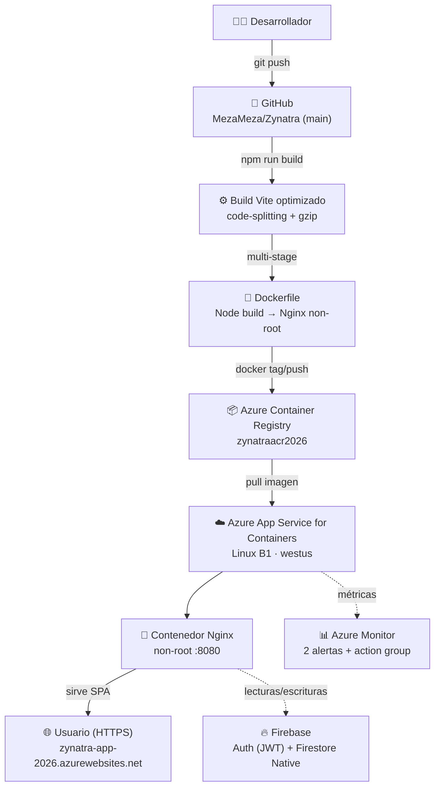
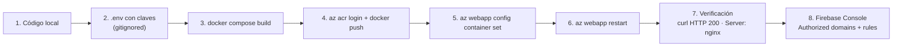
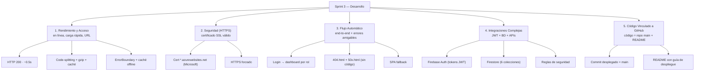
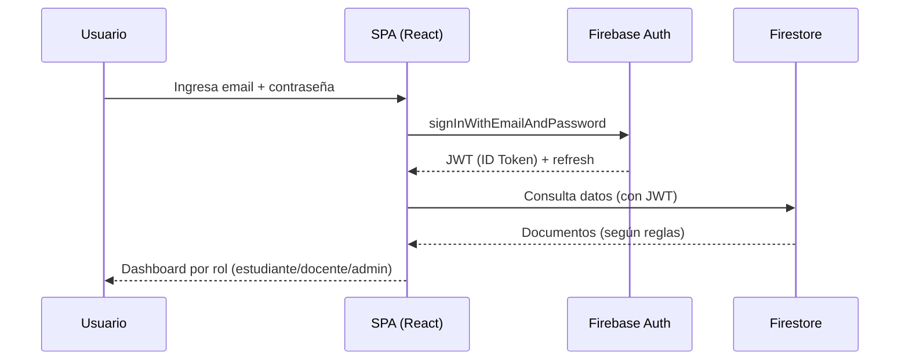

# Entregables — Diagramas de Flujo (ZYNATRA)

> Diagramas en **Mermaid**. Para verlos: pegar el bloque en <https://mermaid.live> → **Actions → Export PNG/SVG** → subir a Canva.
> También se pueden renderizar con `npx -y @mermaid-js/mermaid-cli -i archivo.mmd -o salida.svg`.

---

## 1. Arquitectura de despliegue (pipeline completo)

## 2. Flujo de despliegue (paso a paso)

## 3. Entregables Sprint 2 (Desarrollo)

```mermaid
flowchart TD
    S2["Sprint 2 — Desarrollo"] --> E1
    S2 --> E2
    S2 --> E3
    S2 --> E4
    S2 --> E5

    E1["1. Compilación Final<br/>build rápido + comprimido"] --> E1a["Vite manualChunks + React.lazy"]
    E1 --> E1b["gzip pre-compresión (15 assets)"]
    E1 --> E1c["Sin warning >500 kB"]

    E2["2. Servidor Seguro<br/>Azure + non-root + monitoreo"] --> E2a["App Service (VM bloqueada por política)"]
    E2 --> E2b["Contenedor Nginx non-root (UID 101)"]
    E2 --> E2c["2 alertas + action group + logging"]

    E3["3. Proxy Inverso<br/>Nginx / Apache"] --> E3a["Server: nginx (verificado)"]
    E3 --> E3b["Código nunca expuesto directamente"]

    E4["4. Contenedores<br/>Docker / aislamiento"] --> E4a["Dockerfile multi-stage"]
    E4 --> E4b["docker-compose (app + proxy)"]
    E4 --> E4c["Imagen en ACR"]

    E5["5. Conexión y CORS<br/>variables ocultas + permisos"] --> E5a["App Settings (env ocultas)"]
    E5 --> E5b["Firebase Authorized Domains"]
    E5 --> E5c["Firestore rules por rol"]
```

## 4. Entregables Sprint 3 (Desarrollo)

## 5. Flujo de autenticación (usuario)

